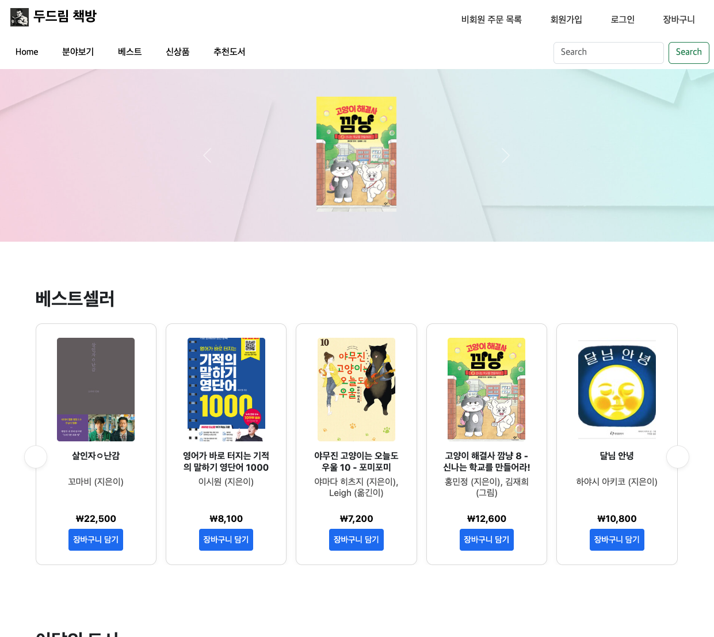

#  NHN24 Dodream Bookstore

## 🌐 도메인

https://dodream.shop

## 📚 통합 API 문서

https://dodream.shop/docs/index.html

---
## 🧑‍🤝‍🧑 팀원소개

| 이주헌 | 김현진 | 임건우 | 송상진 | 유지석 | 차건희 | 박진환 |
|--------|--------|--------|--------|--------|--------|--------|
| <a href="https://github.com/LeeJuheonT6138"> 
<b>이주헌</b>
</a> | <a href="https://github.com/HJin-00"> 
<b>김현진</b>
</a> | <a href="https://github.com/GW000"> 
<b>임건우</b>
</a> | <a href="https://github.com/song-sang-jin"> 
<b>송상진</b>
</a> | <a href="https://github.com/MonaLisaSy"> 
<b>유지석</b>
</a> | <a href="https://github.com/gunheecha"> 
<b>차건희</b>
</a> | <a href="https://github.com/spdlqjxp"> 
<b>박진환</b>
</a> |

---
## 🗂️ ErdCloud

https://www.erdcloud.com/d/nHdEc6k4QQA34zRwr

---
## 🛠️ System Architecture

- 사용자가 브라우저에서 API 요청을 보내면, 해당 요청은 먼저 Cloudflare에서 수신되어 보안 및 최적화 처리를 거친 후 Nginx로 전달됩니다.  
Nginx는 리버스 프록시와 로드 밸런싱을 수행한 뒤 요청을 Gateway에 전달하고,  
Gateway는 클라이언트로부터 전달받은 JWT 토큰을 검증하여 사용자 인증 및 인가 처리를 수행한 후,  
Eureka 서버에 등록된 마이크로서비스 목록 중 적절한 인스턴스를 조회해 인증된 사용자 정보를 포함한 요청을 내부 서비스로 동적으로 라우팅합니다.  

- User 서비스는 회원가입이나 구매 등 이벤트가 발생했을 때 RabbitMQ를 통해 메시지를 비동기적으로 발행하고,  
Coupon 서비스는 해당 메시지를 소비하여 쿠폰 발급 등 후속 작업을 처리합니다.  
또한, Logstash는 MySQL 데이터를 주기적으로 확인하여 변경 사항이 감지되면,  
이를 Elasticsearch 인덱스에 자동으로 동기화하여 검색 및 분석 시스템에서 활용할 수 있도록 지원합니다.

---
## 🚀 CI/CD

- Main, Develop, Feature 브랜치를 사용하는 GitFlow 전략으로 진행하였고 GitHub Actions 를 통해 PR 단계에서는 Build 테스트와 Run 후 Health Check 성공 여부를 확인하고 성공시 Merge 가 이루어 집니다. Main 브랜치로 Merge 즉 포괄적으로 Push 가 완료되면 서버에 배포를 실행하도록 WorkFlows 를 구성했습니다.

---
## ✅ Test Coverage
🔐 인증/인가 API  

 

🛒 장바구니 API  

 

🎟️ 쿠폰 API  

 

📦 주문 API  

 

👤 사용자 관리 API  

 

📚 도서 API  

---
## 💼 담당 업무

### 인프라
* 담당자: 이주헌
  - CI/CD 구축(GitHub Action) 진행
  - Spring Cloud 환경 구성(Gateway, Eureka) 참여 (이주헌, 김현진)
  - 무중단 배포 구현

### 게이트웨이
* 담당자: 김현진
  
### 인증/인가
* 담당자: 김현진
  - JWT 기반 인증/인가 구현
  - 일반 로그인, 페이코 로그인 구현
  - 휴면 회원 Messanger 인증

### 회원
* 담당자: 임건우
  - 회원 가입, 회원 주소 관리(CRUD), 회원 등급 관리
  - 회원 탈퇴
  - 휴먼 회원 전환 (batch)
  - 회원 등급 변경 (batch)
  - 관리자 회원 관리

### 도서
* 담당자: 송상진
  - 도서 CRUD 
  - 외부 API(알라딘, 네이버) 활용 도서 등록
  - TUI Editor 활용 도서 등록
  - Object Storage 및 이미지 관리 (임건우, 송상진)
  - 좋아요 기능, 선물포장 설정, 도서 상세페이지 뷰

### 카테고리
* 담당자: 유지석
  - 카테고리 및 Tag 관리

### 태그
* 담당자: 유지석

### 검색
* 담당자: 유지석, 송상진
  - 검색 가중치 적용(도서명, 내용, 카테고리 등)
  - 정렬 기준 적용(인기도, 신상품, 최저가, 평점, 리뷰 등)
  - 동의어 및 유의어 검색 적용

### 장바구니
* 담당자: 차건희
  - 장바구니 구현 및 비회원 장바구니 구현
  - 장바구니 영구 유지

### 주문
* 담당자: 박진환
  - 비회원 및 회원 주문 처리
  - 주문 옵션 설정(포인트, 배송일, 포장 등)
  - 주문 취소 및 주문 내역 조회(회원, 비회원)
  - 관리자 주문 상태 관리

### 결제
* 담당자: 박진환
  - 토스페이 연동 결제 구현
  - 포인트 결제, 쿠폰 적용

### 리뷰
* 담당자: 임건우
  - 리뷰 구현

### 쿠폰
* 담당자: 이주헌
  - Welcome 쿠폰, 생일 쿠폰, 도서 및 카테고리 쿠폰
  - MQ 적용 (이주헌, 임건우)

### 포인트
* 담당자: 임건우
  - 포인트 규정 설정 및 신규 가입, 리뷰, 주문 적립
  - 주문 적립 (박진환, 임건우)

### MyPage
* 담당자: 이주헌, 임건우
  - 회원 정보 수정
  - 회원 주소 CRUD
  - 회원 주문 내역 조회
  - 회원 작성한 리뷰 조회
  - 쿠폰 내역 조회 (이주헌, 임건우)
  - 포인트 사용 내역 조회
  - 좋아요 내역 조회

---
# 🛠️ Tech Stack

| 카테고리 | 기술 스택 |
|----------|-----------|
| 💻 Backend |        |
| 🛢️ Database |  |
| 🐰 Messaging & Security |    |
| 🔍 Quality & CI/CD |    |
| 💻 OS & Web Server |    |
| 🔎 Search & Logging |    |
| 🌐 Frontend |     |

