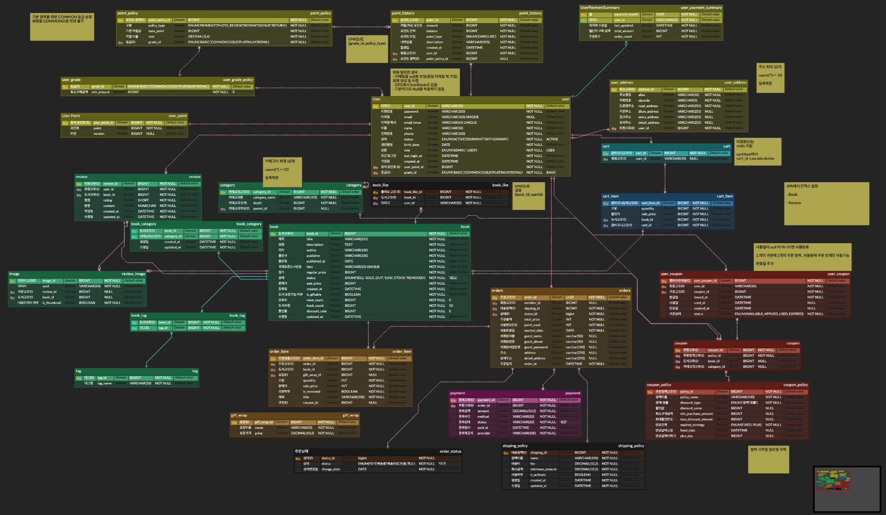
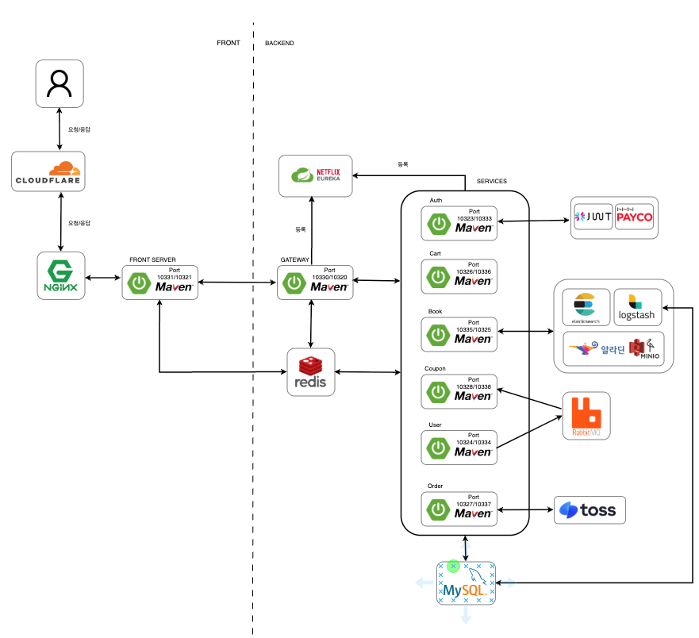
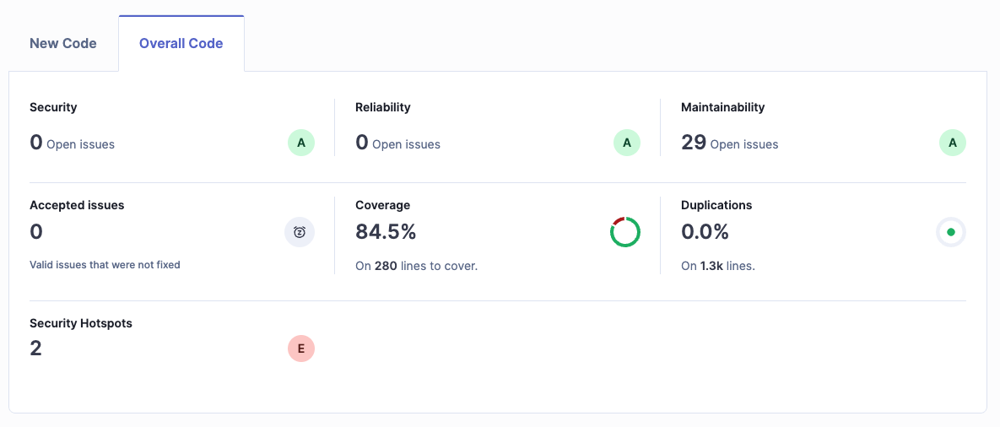
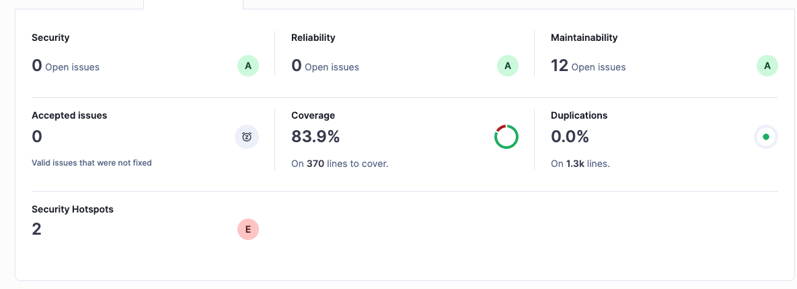
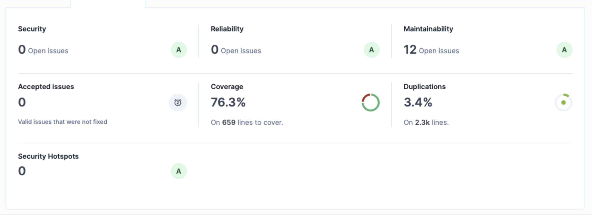
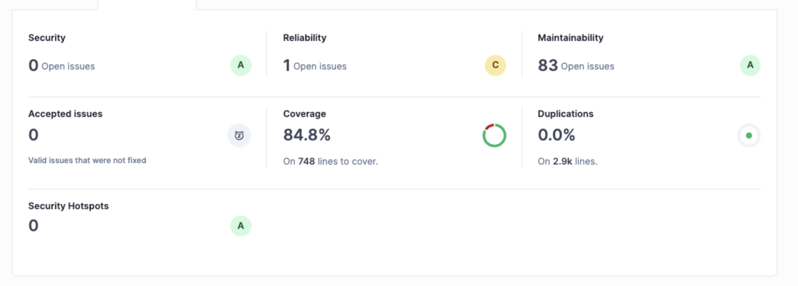
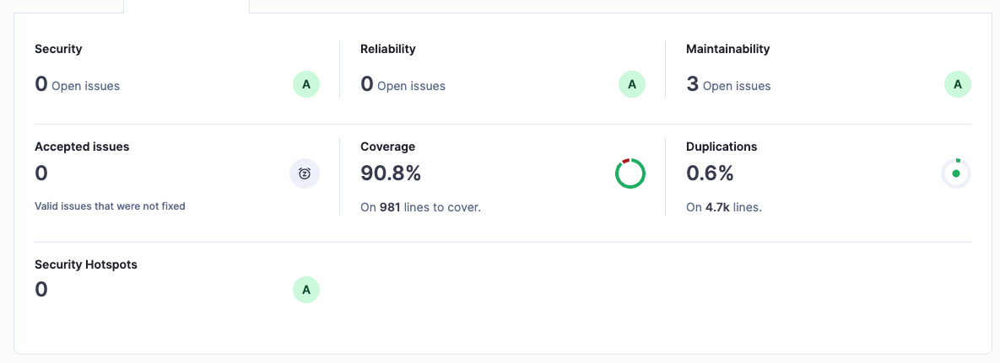
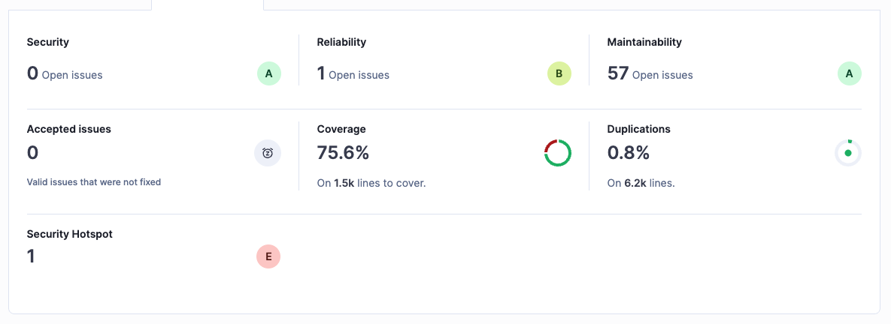

#  NHN24 Dodream Bookstore

## 🌐 도메인

https://dodream.shop

## 📚 통합 API 문서

https://dodream.shop/docs/index.html

---
## 🧑‍🤝‍🧑 팀원소개

| 이주헌 | 김현진 | 임건우 | 송상진 
|--------|--------|--------|--------|
| <a href="https://github.com/LeeJuheonT6138"> <b>이주헌</b></a> | <a href="https://github.com/HJin-00"> <b>김현진</b></a> | <a href="https://github.com/GW000"> <b>임건우</b></a> | <a href="https://github.com/song-sang-jin"> <b>송상진</b></a> |

| 유지석 | 차건희 | 박진환 |  
|--------|--------|--------|
| <a href="https://github.com/MonaLisaSy"> <b>유지석</b></a> | <a href="https://github.com/gunheecha"> <b>차건희</b></a> | <a href="https://github.com/spdlqjxp"> <b>박진환</b></a> | &nbsp; |

---
## 🗂️ ErdCloud

https://www.erdcloud.com/d/nHdEc6k4QQA34zRwr

---
## 🛠️ System Architecture

### 사용자 (브라우저) → Cloudflare

- 사용자가 'https://dodream.shop' 입력
- 브라우저가 DNS 질의 수행
- Cloudflare가 가장 가까운 Edge Server IP 반환  
- 공인 IP 노출 없이 요청 처리 (보안상 이점)
- 해당 Edge 서버에 HTTPS 요청 전달

### Cloudflare → Nginx

- Cloudflare Edge Server가 SSL 해제 (Flexible 모드 기준)
- 캐시 확인 후 없으면 아래 주소로 요청 전달  
  'http://220.67.216.11:80'  
- 220.67.216.11: 서버의 공인 IP
- Nginx는 80 포트에서 요청 수신
- 모든 요청은 Nginx를 거쳐 내부 애플리케이션으로 전달 (proxy_pass)

---
## ✅ Test Coverage
🔐 인증/인가 API  

 

🛒 장바구니 API  

 

🎟️ 쿠폰 API  

 

📦 주문 API  

 

👤 사용자 관리 API  

 

📚 도서 API  

---
## 💼 담당 업무

### 인프라
* 담당자: 이주헌
  - CI/CD 구축(GitHub Action) 진행
  - Spring Cloud 환경 구성(Gateway, Eureka) 참여 (이주헌, 김현진)
  - 무중단 배포 구현

### 게이트웨이
* 담당자: 김현진
  
### 인증/인가
* 담당자: 김현진
  - JWT 기반 인증/인가 구현
  - 일반 로그인, 페이코 로그인 구현

### 회원
* 담당자: 임건우
  - 회원 가입, 회원 주소 관리(CRUD), 회원 등급 관리
  - 회원 탈퇴, 휴면 회원 관리(김현진, 임건우)
  - 관리자 회원 관리

### 도서
* 담당자: 송상진
  - 도서 CRUD 및 출판사, 저자 CRUD
  - 외부 API(알라딘, 네이버) 활용 도서 등록
  - TUI Editor 활용 도서 등록
  - Object Storage 및 이미지 관리 (임건우, 송상진)
  - 좋아요 기능, 선물포장 설정, 도서 상세페이지 뷰

### 카테고리
* 담당자: 유지석
  - 카테고리 및 Tag 관리

### 태그
* 담당자: 유지석

### 검색
* 담당자: 유지석, 송상진
  - 검색 가중치 적용(도서명, 내용, 카테고리 등)
  - 정렬 기준 적용(인기도, 신상품, 최저가, 평점, 리뷰 등)
  - 동의어 및 유의어 검색 적용

### 장바구니
* 담당자: 차건희
  - 장바구니 구현 및 비회원 장바구니 구현
  - 장바구니 영구 유지

### 주문
* 담당자: 박진환
  - 비회원 및 회원 주문 처리
  - 주문 옵션 설정(포인트, 배송일, 포장 등)
  - 주문 취소 및 주문 내역 조회(회원, 비회원)
  - 관리자 주문 상태 관리

### 결제
* 담당자: 박진환
  - 토스페이 연동 결제 구현
  - 포인트 결제, 쿠폰 적용

### 리뷰
* 담당자: 임건우
  - 리뷰 구현

### 쿠폰
* 담당자: 이주헌
  - Welcome 쿠폰, 생일 쿠폰, 도서 및 카테고리 쿠폰
  - MQ 적용 (이주헌, 임건우)

### 포인트
* 담당자: 임건우
  - 포인트 규정 설정 및 신규 가입, 리뷰, 주문 적립
  - 주문 적립 (박진환, 임건우)

### MyPage
* 담당자: 이주헌, 임건우
  - 회원 정보 수정
  - 쿠폰 내역 조회 (이주헌, 임건우)
  - 포인트 사용 내역 조회
  - 좋아요 내역 조회

---
# 🛠️ Tech Stack

💻 Backend

🛢️ Database

🐰 Messaging & Security

🔍 Quality & CI/CD

💻 OS & Web Server

🔎 Search & Logging

🌐 Frontend

🎥 Netflix OSS

